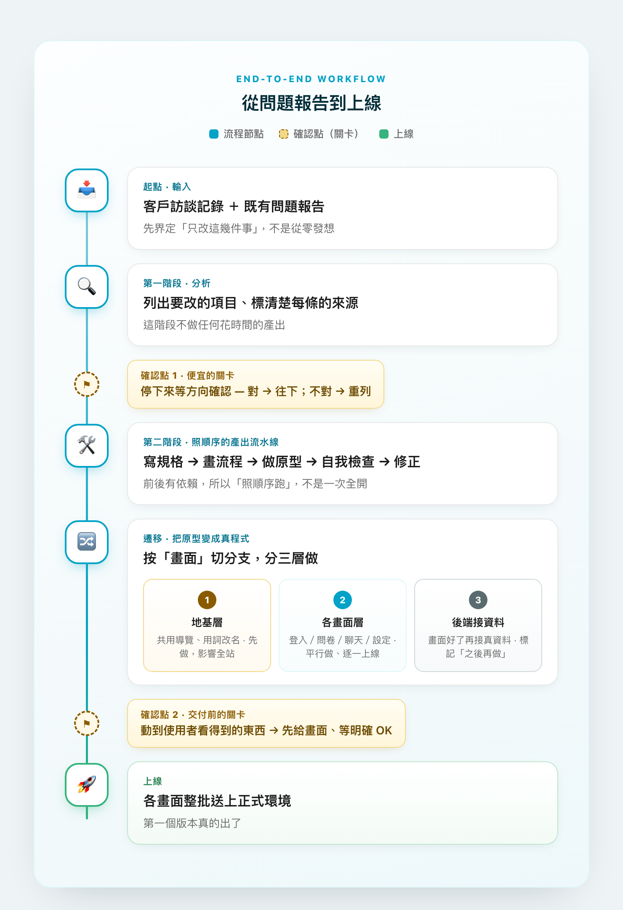

# 我做的 AI 設計工作流叫「全自動」——它最需要的其實是停下來

## 設計師用 AI 跑完一次完整產品改版，學到的不是怎麼下指令，而是把確認點放在哪

> 我把自己的設計流程打包成一個指令，還特地在裡面交代「不要停下來問問題」。然後拿它跑第一個真專案，第四天就翻車。這篇是翻車之後重新整理出來的工作流——工具不限，原則共通，給也在摸索的同行參考。

---

在這次改版開工之前，我把自己的設計流程打包成了一個指令，叫 `/design-flow`。

標題是我自己下的：「**全自動**設計工作流程」。裡面還特地交代一句——*流程啟動後，Phase 之間不主動停下來問問題*。一句話下去，需求分析 → 寫規格 → 畫流程 → 做原型 → 自我審查 → 修正，一路跑到底。我對它很滿意。

然後我拿它跑第一個真的專案：一次完整的產品改版。開工第四天，我正打算照它的精神一條龍衝完——爬會議記錄 → 列改善項目 → 寫規格 → 畫流程 → 做原型——結果被當場問住：編號是亂的、邊界是糊的、**中間一個關卡都沒有**。

我愣了一下。我自己寫的流程，最得意的地方就是「不停」。

如果你也是設計師，最近開始用 AI 把設計做成能跑的東西——但常常做到一半流程就亂掉、不確定該一次叫 AI 做多少、改完又怕弄壞別的地方——這篇大概會有點用。

這篇就是那次翻車之後，我重新整理出來的東西。整個改版從一份問題報告開始，一路到把程式碼上線；過程中真正花腦力的不是「怎麼跟 AI 下指令」，而是**怎麼安排整個工作流程**——哪裡可以讓 AI 自己跑、哪裡得先停下來確認、一個任務該切多大、改完怎麼安全地交出去。

下面把整套流程攤開來講：先看全貌，再一步一步走過六個步驟。**我用的是 Claude Code，但原則換成 Cursor、Windsurf 或任何 AI coding 工具都成立。**

（文中會出現幾個名詞——vibe coding、skill、agent、branch／worktree——如果不熟，文末有一段一句話解釋，先跳過不影響閱讀。）

---

## TL;DR — 三十秒看完

- **把確認點放在最便宜的地方**：分析完先停、確認方向，才讓 AI 進入花時間的產出。要犯錯，就錯在還沒花大成本之前。
- **分清楚「照順序」跟「能平行」**：有前後依賴的工作讓 AI 照順序跑；真正獨立的工作才開好幾個 AI 一起做。
- **把原型變成真程式時，按「畫面」切，不是按「功能流程」切**：才能一個畫面一個畫面分批上線。
- **給 AI 一份「進度大腦」檔**：AI 會忘記，所以要有一份檔記著做到哪、哪條分支、哪裡跟原計畫不同。跨好幾天的工作就靠它接得上。
- **邊做邊質疑前提**：最值得分享的決定，常是「做過一遍才發現原本想錯了」來的。
- **交出去之前再卡一關**：動到使用者看得到的東西，先給畫面、等確認，才正式上線。

---

## 01　先看全貌：整條流程長這樣

先用一張圖把整件事講完。看的時候可以特別留意**兩個黃色的關卡**——它們是這套流程裡我覺得最值得分享的部分：把風險擋在還很便宜的地方。

> 整套流程其實就一個原則：把確認點放在最便宜的接縫上。要犯錯，就錯在還沒花大成本的地方。

---

## 02　六個步驟，一步一步走

### 1. 從「客戶訪談＋問題報告」界定範圍

起點不是打開設計工具開始發想，而是先讀**客戶訪談記錄**跟一份既有的問題報告，把要做的事收斂成「只要改這幾件」。一開始就先想清楚一件事：**這個資料夾是「設計交付物」還是「程式碼」？** 我把它定位成設計工作區，這個決定影響了後面所有「東西該放哪」的判斷。

不管你用什麼工具，這步都一樣：先讓 AI 幫你把訪談／回饋整理成「要改的清單」，而不是直接叫它做設計。範圍沒收斂前，做什麼都是猜。

### 2. 把任務分兩階段，中間設確認點

我原本想一條龍做完：訪談 → 列問題 → 寫規格 → 畫流程 → 做原型。後來改成**兩階段**：第一階段只列出要改的項目、標清楚來源，然後*停下來等我確認方向*；第二階段才進規格、流程、原型。理由很現實——第一步方向錯，後面花一整天做的東西全部白費。

> 🔄 **換成你的工具**：在任何 AI 工具裡，這只是一句話的事——「先只做分析、列出方向，做完停下來等我確認，先不要動手做原型。」別讓 AI 一口氣衝到底。

### 3. 分清楚「照順序」和「能平行」

這是我這次調整最多的一個觀念。寫規格 → 做原型 → 檢查 → 修正，這幾步**前一步是後一步的輸入，彼此有依賴**，所以得照順序跑、中間還要停下確認。如果這時候同時開好幾個 AI 各做各的，它們會略過中間的確認點，最後做出來的東西常常兜不起來。

我自己的做法，是把這串固定步驟包成一個叫 `/design-flow` 的 skill（把一串固定步驟打包成一個指令，叫一聲就照順序跑）。但**重點不是這個 skill，而是「照順序、中間會停」這個概念**——沒有 skill 也做得到：就一步一步手動叫，「先寫規格」→ 你看過 →「根據規格做原型」→ 你看過 →「自己檢查一遍有沒有問題」。重點是節奏在你手上，工具炫不炫倒是其次。

> 🤖 **一句話總結**：「用多個 AI」不等於「一堆 AI 同時開」。有前後依賴的工作 → 照順序，一棒接一棒；真正彼此獨立的工作 → 才開好幾個一起做。選錯，你精心設的確認點就會被跳過。

### 4. 把原型變成真程式：按「畫面」切，不是按「流程」切

這是我第一次把一個互動原型真的搬進現有的產品裡。一開始我按「功能流程」來切分工作（例如「改註冊流程」當一塊），**實際做過一遍才發現不對**：一個流程會穿過好幾個畫面，改完流程，每個畫面還得回頭一一調整，根本沒辦法分批上線。後來改成**按「畫面」切**——登入頁一塊、設定頁一塊——每塊獨立、可以單獨上線。

再把整批工作分成三層：**地基層**（共用的導覽、用詞，會影響全站，先做）→ **各畫面層**（彼此獨立，平行做、逐一上線）→ **接資料層**（畫面都好了再接真資料）。

> 🔄 **換成你的工具**：通用原則——讓 AI 一次只專心改一個畫面，改完那個畫面就能看、能驗收、能單獨上線。「按畫面切」對設計師其實最直覺，你本來就是一頁一頁設計的。

### 5. 真正獨立的部分，才開多個 AI 平行做

到了各畫面層，帳號頁和工作區頁這兩個**彼此完全不相干**，這時我才開兩個 AI 平行做，各自在自己的程式碼副本上跑、互不打架（這就是 worktree）。做完再統一把版型、字級對齊，把重複用到的元件抽成共用的。這段是我刻意拿來練「多 AI 協作」的——但前提是：**確定這兩塊真的獨立，才平行**。

入門階段其實不急著平行。先把「照順序、一次一塊」練熟，等你能清楚判斷「哪兩塊真的不相干」，再開平行——不然只是同時製造兩團亂。

### 6. 一個小改動、一次驗收，然後才上線

收尾階段我用**「改一項、看一次、確認 OK 才存檔」**的節奏：每改一個小地方（一個 icon、一個 hover、一個命名）就截圖確認。小批次、低風險、出問題容易回溯。最後各畫面整批送上正式環境，第一個版本真的出了。

> 🔄 **換成你的工具**：通用守則——動到使用者看得到的東西，先讓 AI 給你截圖或跑起來看，確認 OK 才正式存檔／上線。不要讓 AI 一次改十處再一起丟給你，出錯你會找不到是哪一處。

---

## 03　最該補上的一塊：給 AI 一份「進度大腦」

這塊是我吃過幾次虧才補上的，少了它，前面六步其實串不太起來，所以想多講一點。

有天我打開前一天還在做的專案，跟 AI 說「繼續」。它很乾脆地動手——改的卻是我兩天前就決定**不要**的方向。我愣了一下：欸，我們不是講好了嗎。

後來才想通：*它其實不記得「前一天」。對它來說，每次對話都是第一天上班。*

原因就是這個：**它會忘記**。每開一個新對話、隔一天回來，它不記得這個專案上次做到哪、為什麼那樣決定、哪條線在做什麼。如果每次都得從頭重講一遍，蠻累的；而且它還會自己**照著早就過時的舊計畫繼續做**。

解法很簡單：在專案裡放**一份「進度大腦」檔**（我自己叫它「狀態板」）。整個專案「做什麼、做到哪、哪條線在做」就看這一份。每次開工第一件事，是叫 AI 讀它；收工前，叫 AI 更新它。

### 這份檔裡至少要有三件事

而且第三件最常被忽略、卻最重要。以我這次的專案為例，它長這樣：

**① 現在做到哪**

> 第一階段換皮已整批上線。登入頁、設定頁、聊天頁完成；剩「接真實資料」待後端。下一步：問卷頁換皮。

**② 每個任務對到哪條分支、什麼狀態**

- 🟢 側邊欄改版（影響全站）— `redesign/sidebar` — 完成
- 🟢 登入頁 — `redesign/login` — 完成
- 🟢 設定頁 — `redesign/settings` — 完成
- 🟡 問卷頁 — `redesign/survey` — 進行中
- ⚪ 接真實資料 — `data/api-wiring` — 待後端

**③ ⚠ 跟原計畫不同、要修正的地方**

- ~~問卷從 5 題縮成 3 題~~ → **撤回**：改題數要後端配合，先只換樣式。
- ~~帳單放「個人帳號」層~~ → **翻盤成「每個空間各自計費」**：因為實際計費邏輯是這樣。
- ~~登入、問卷各開一條分支~~ → **合併成一條**：兩者其實高度相關，分開反而麻煩。

第三區是這份檔最容易被略過、卻最該寫的部分。**計畫一定會變**——做著做著你就會發現原本想的不太對。如果這些「轉彎」沒寫下來，AI（還有三天後的你自己）就會繼續照舊計畫做。把偏差明確記進去，AI 才接得上、才知道哪裡要修正，而不是默默走回老路。

> 🌿 **順帶一提：分支名稱要先取好、要有規律。** 注意上面每個任務都對好了一條分支（branch ＝一條獨立的修改線，做壞了不影響正式版）。名稱用同一套規律命名——例如全部 `redesign/` 開頭加畫面名（`redesign/login`、`redesign/settings`）。這樣 AI 一看分支名就知道這條在做什麼，你回頭看也一目了然。命名亂七八糟，AI 跟你都會迷路。

### 進階：其實有「兩種」記憶檔，別搞混

這是我繞了一圈才搞清楚、新手最容易塞錯地方的一件事。AI 的記憶其實該分成**兩份不同的檔**，因為它們的「變動頻率」天差地遠：

**📐 規則檔（`CLAUDE.md` / `.cursorrules`）**
- 放什麼：永遠成立的事——專案是什麼、用什麼技術、設計風格規範、還有「開工先讀進度檔」這類習慣。
- 多久變一次：很少。定好就放著。
- 像什麼：員工手冊——每個新人（每次新對話）都該先讀的那本。

**🧠 進度檔（`PROGRESS.md`）**
- 放什麼：一直在變的現況——做到哪、哪條分支、哪裡跟原計畫不同。
- 多久變一次：每次收工都更新。
- 像什麼：每日交接本——這次做了什麼、下次從哪接。

很多工具的「規則檔」會在**每次對話自動被讀進去**（像 Claude Code 的 `CLAUDE.md`、Cursor 的 `.cursorrules`），所以你只要在裡面寫一句「*每次開工先讀 PROGRESS.md*」，AI 之後就會自動去翻進度檔，連提醒都省了。新手常犯的錯，是把「進度」也塞進規則檔——結果它越長越亂，每次自動讀又貴又慢。**口訣：不會變的進規則檔，一直變的進進度檔。**

### 為什麼這對設計師特別重要

我們習慣把進度放在腦袋裡，或散在 Figma 各個檔案——但 **AI 讀不到你的腦袋**。這兩份檔就是你跟 AI 之間的「共同記憶」：有了它們，AI 比較像「記得專案脈絡的隊友」，而不是「每次都要重新帶一遍的實習生」。對我來說，這是讓跨好幾天的工作不至於亂掉的關鍵。

> 🔄 **換成你的工具**：任何 AI coding 工具都適用，檔名不重要（`PROGRESS.md`、`STATUS.md`、`tasks.md` 都行）。最低限度：放一份進度檔在專案裡，每次對話開頭請 AI 讀、結尾請它更新。有「自動讀規則檔」功能的工具，再把「開工先讀進度檔」這條寫進去，就能全自動。

---

## 04　結論：如果你也在找自己的工作流

這次最大的收穫，是從「交設計檔的設計師」往「能把一條完整流程帶到上線的設計師」挪了一步。AI 與其說讓我做得更快，不如說逼我**把工作流程本身想清楚**——哪裡有依賴、哪裡該停下確認、哪裡能放手平行。

給正在同一條路上的同行一句話：**不用急著追最新的工具或開最多的 agent**。先把「分階段、設確認點、一次一塊、改完先看」這幾件基本功練熟，流程大致就穩了。下面是整理好的版本，可以直接拿去改：

**可以照著套的工作流**

- **起點**：用客戶訪談＋既有報告，先界定「只改哪幾件事」。
- **分兩階段**：① 先列方向、停下確認 → ② 才進規格／流程／原型。
- **分工**：有依賴的工作照順序跑、中間設關卡；真正獨立的才平行做。
- **進度大腦**：放一份檔記著「做到哪／哪條分支／哪裡跟原計畫不同」，開工先讀、收工更新。
- **變成真程式**：按「畫面」切，不是按「流程」切；分地基→各畫面→接資料三層。
- **守邊界**：不動別人的共用設定、設計文件跟程式碼分開、不同工作分開做。
- **收尾**：改一項看一次、交出去前先給畫面、把方法記下來下次直接套。

最後一件事。

開頭那個 `/design-flow`，我到現在都沒改它——標題還是「**全自動**設計工作流程」，裡面那句「流程啟動後 Phase 之間不主動停下來問問題」也還在。

寫這篇之前我以為結論會是「我學到教訓，於是把工具修好了」。但真相是我根本沒動那個工具。我改的是**我自己怎麼用它**——什麼時候放手讓它跑，什麼時候把它攔下來。

工具不會幫你設關卡。關卡是你設的。

> 找工作流的重點，不在「用多少 AI」，而在「把確認點放在最便宜的接縫上」。

---

## 附錄：文中名詞，一句話版

- **Vibe Coding**：用自然語言叫 AI 幫你寫程式、做出能跑的成品，而不是自己一行一行寫。設計師現在能靠它把原型變成真產品。
- **Skill（技能 / 自訂指令流程）**：把一串「固定要做的步驟」打包成一個指令，下一次叫一聲就照順序跑。文中的 `/design-flow` 就是我自己建的一個，功能是按順序跑「寫規格 → 畫流程 → 做原型 → 自我檢查 → 修正」。你不一定要會建 skill，把這些步驟手動一步一步叫 AI 做，效果一樣。
- **Agent（代理）／並行 Agent**：一個能自己連續做好幾步、不用你每步盯著的 AI 工人。「並行 agent」＝同時開好幾個 AI、各做一塊，加快速度。
- **分支（branch）／工作副本（worktree）**：程式碼的版本控管概念。branch ＝一條獨立的修改線，做壞了不影響正式版；worktree ＝讓每個 AI 在自己的程式碼副本上做事，彼此不會打架。你只要知道「可以開好幾條線平行做、最後再合併」就夠了。
- **Checkpoint（確認點 / 關卡）**：我自己取的叫法——在流程中刻意停下來、讓人確認方向再往下的點。這篇的核心觀念。
